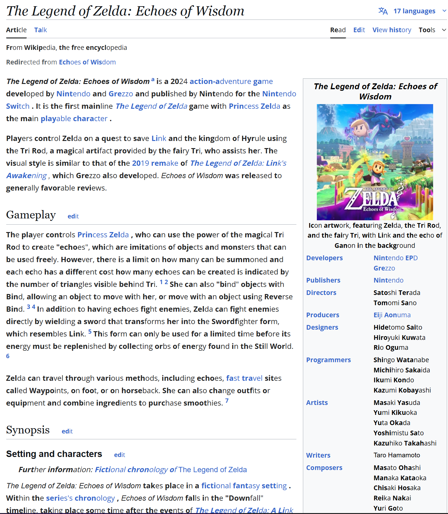

# Site Read – A Web-Accessible Reading Extension #
Site Read is a Chrome extension designed to enhance online readability, especially for neurodiverse users. Its primary focus is on improving the reading experience for people with conditions such as ADHD, dyslexia, and visual impairments, by making websites easier to process and navigate.

## 🔍 Current Features ##
Bionic Reading Effect: Automatically highlights parts of words to improve focus and scanning, especially helpful for readers with ADHD or dyslexia.

Applies to common content areas like paragraphs, lists, and articles.

Leaves out links, headings, and already-bolded text to avoid confusion or redundancy.

## 🎯 Upcoming Accessibility Goals ##
- Dyslexia-Friendly Fonts: Support for fonts like OpenDyslexic and Lexend to reduce reading strain.

- Custom Font Size Control: Let users adjust text size for personal comfort.

- Contrast Controls: Improve visibility for users with low vision by offering high-contrast or inverted color options.

- Color Customization for Color Blindness: Ensure no essential meaning is lost due to color-only distinctions.

- Text Spacing Adjustments: Control over line height and word spacing to ease cognitive load.

- Toggle On/Off by Element Type: Choose which types of content (paragraphs, lists, etc.) the extension should affect.

- ARIA Support: Use semantic HTML and ARIA labels to assist screen readers.

## Current demo

**Before site read**

**After turning on site read**

